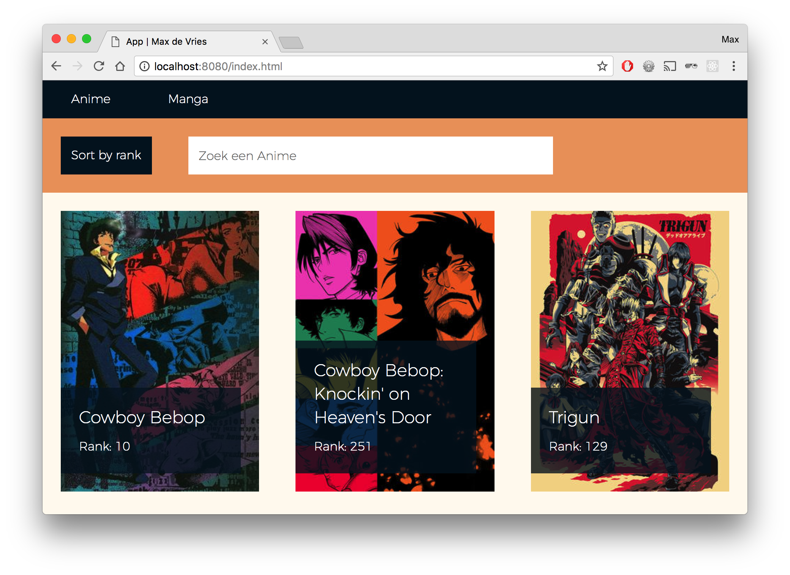
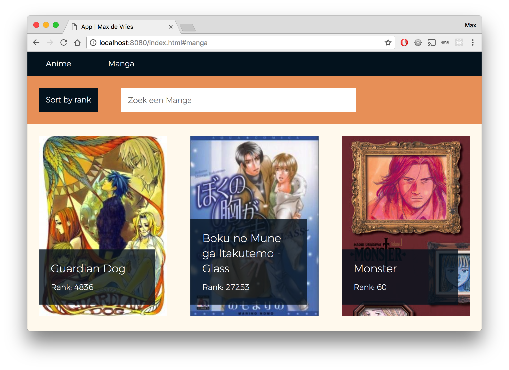
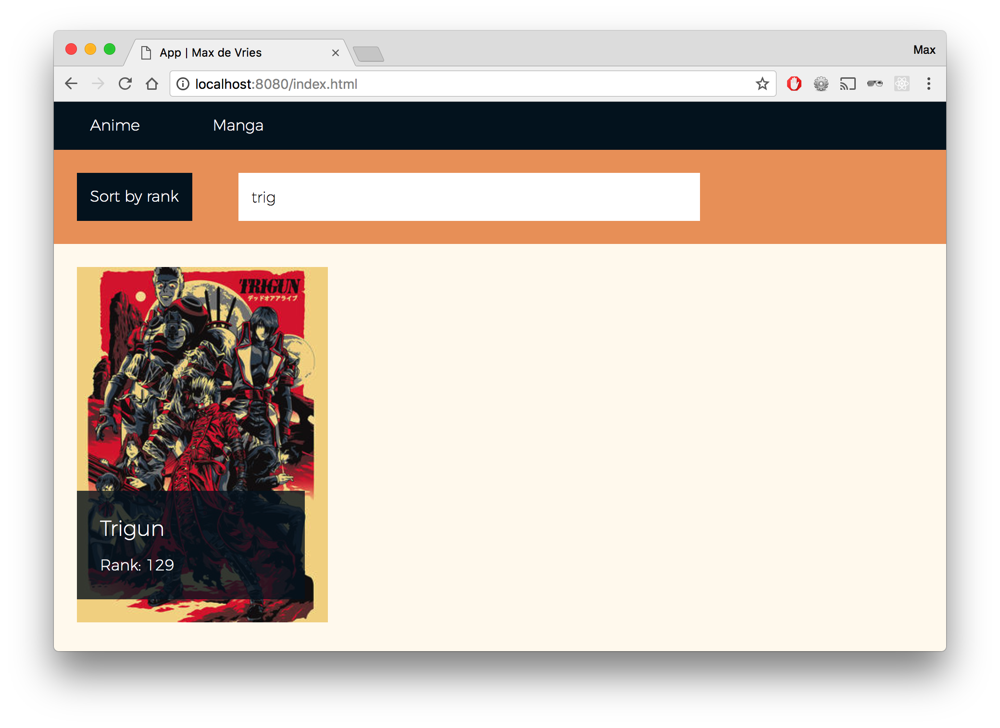
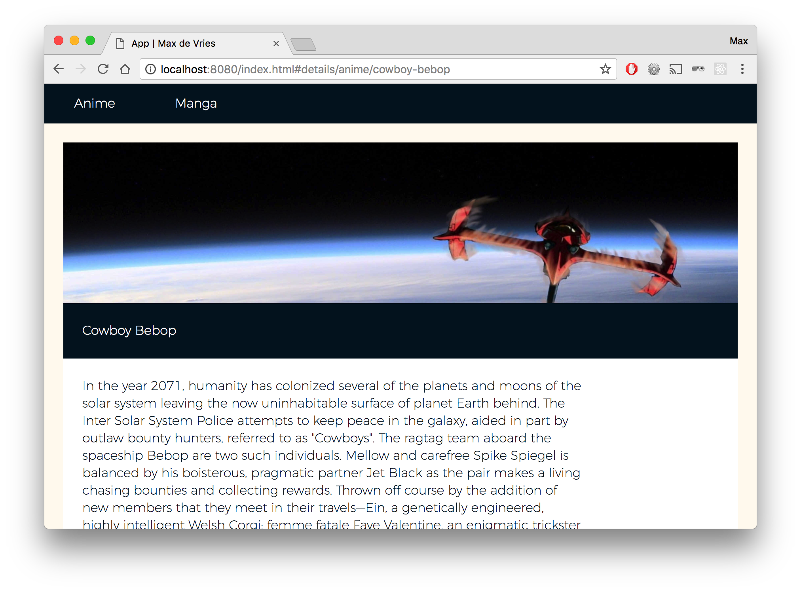
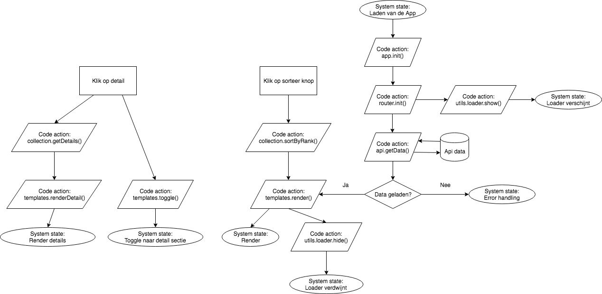
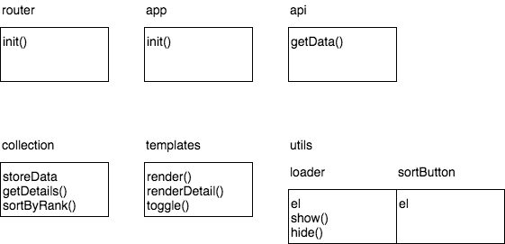

# Web App from Scratch | Anime/Manga App



[Demo](https://vriesm060.github.io/wafs/app)

This is a web app that features Anime and Manga shows, fetched from the [Kitsu API](https://kitsu.docs.apiary.io/).

## Table of Contents

* [Frameworks](#frameworks)
* [Installation](#installation)
* [Data](#data)
* [Features](#features)
* [Usage](#usage)

## Frameworks

The app has been build using the following frameworks and npm packages:

* [Routie JS](http://projects.jga.me/routie/)
* [Transparency JS](https://github.com/leonidas/transparency)

## Installation

Before you can run the app, you have to install a npm package called `http-server`, which you can find [here](https://www.npmjs.com/package/http-server). Run `npm install http-server -g` in your terminal to install it globally. You will need this package to run the app locally.

After this, you can run the app for yourself locally, `git clone` this repository (https://github.com/vriesm060/wafs), `cd` to the directory in your terminal and start the app by writing `http-server` in the terminal.

## Data

The data that is being used comes from the [Kitsu API](https://kitsu.docs.apiary.io/), which features different endpoints for different purposes. There is an endpoint for Anime and one for Manga and there is also one for the user. This app uses the Anime and Manga endpoints.

An endpoint looks something like this:

```
https://kitsu.io/api/edge/anime?fields[anime]=slug,canonicalTitle,posterImage,coverImage,synopsis,popularityRank&page[limit]=20&page[offset]=0
```

After fetching, the data is stored in localStorage: `localStorage.setItem('anime', JSON.stringify(anime.data));`.

When a user navigates to the detail page, the app will look for the data in localStorage first, before making an API call to fetch the data.

When a user uses the sort button or the searchbar, the data is manipulated. This is done using the `sort` and `filter` methods. The data is taken from localStorage.

**Sort:**
```
var sort = JSON.parse(localStorage.getItem(type)).sort(function (a, b) {
  return a.attributes.popularityRank - b.attributes.popularityRank;
});
```

**Filter:**
```
var search = JSON.parse(localStorage.getItem(type)).filter(function (item) {
  if (item.attributes.canonicalTitle.toLowerCase().includes(self.value.toLowerCase())) {
    return item;
  }
});
```

## Features

The app has the following features:

* [x] Overview of Anime and Manga shows
* [x] Detail view of Anime and Manga shows
* [x] Routie JS to navigate between the different pages
* [x] Sorting option to sort the Anime and/or Manga by rank
* [x] Searchbar to find the Anime or Manga you're looking for quicker
* [x] Transparency JS to render the data into HTML
* [ ] Filter option to filter the data by genre
* [ ] Lazy load to load more data
* [ ] A section where the user can find his/her own selected shows

## Usage

#### Overview
---

The overview page for either Anime or Manga shows, features a list of all the shows, with a poster, title and the current popularity rank listed.



#### Search
---

The overview page also gives you access to a sorting button that sorts the Anime and/or Manga by order of popularity. There is also a searchbar what you can use to quickly search for the Anime/Manga you want to see. This can save you some time.



#### Detail
---

When you click on one of the Anime or Manga shows, you go to a detail page that shows you a nice cover image, along with a description of the show in question.

An extra feature in this app is that you can manually navigate to an Anime or Manga of your choice using the url bar when you know the title. For example, you can navigate to the detail page for Cowboy Bebop by adding the route `/cowboy-bebop` to the url. The data will be loaded in even if this show wasn't featured on the overview page.



#### Object Method Diagram
---



#### Flow
---


