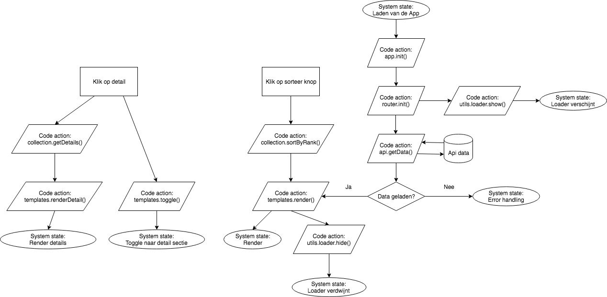
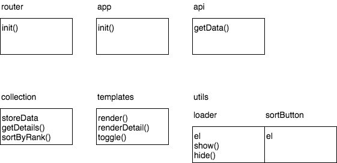

# Web App from Scratch | Max de Vries

[App](https://vriesm060.github.io/wafs/app)

Ik heb een app gemaakt die anime series laat zien. De gebruiker kan sorteren op populariteit en kan per serie de details bekijken in een detail sectie. De [data](https://kitsu.docs.apiary.io/#) voor deze app wordt asynchroon geladen, waarna het gemanipuleerd wordt aan de hand van wat de gebruiker er mee wilt doen.

## Flow

## Object Method Diagram

## Features

* Anime API
* Routie om tussen de verschillende pagina's te navigeren
* Loader om feedback te geven aan de gebruiker dat de API geladen wordt
* Sorteer optie om de data te sorteren op volgorde van rank
* Transparency template engine om de data te renderen in de HTML
* Overzichtspagina met alle anime
* Detailpagina met meer informatie over de anime

## Wishlist

* Filter optie om de data te kunnen filteren op bijvoorbeeld genre
* Meer data kunnen inladen uit de API
* Verschillende datasets kunnen combineren om meer informatie te kunnen geven
* Een sectie waar de gebruiker zijn/haar eigen selectie kan terug vinden.

## Sources

[Anime API](https://kitsu.docs.apiary.io/#)

[Routie.js](http://projects.jga.me/routie/)

[Transparency.js](https://github.com/leonidas/transparency)
